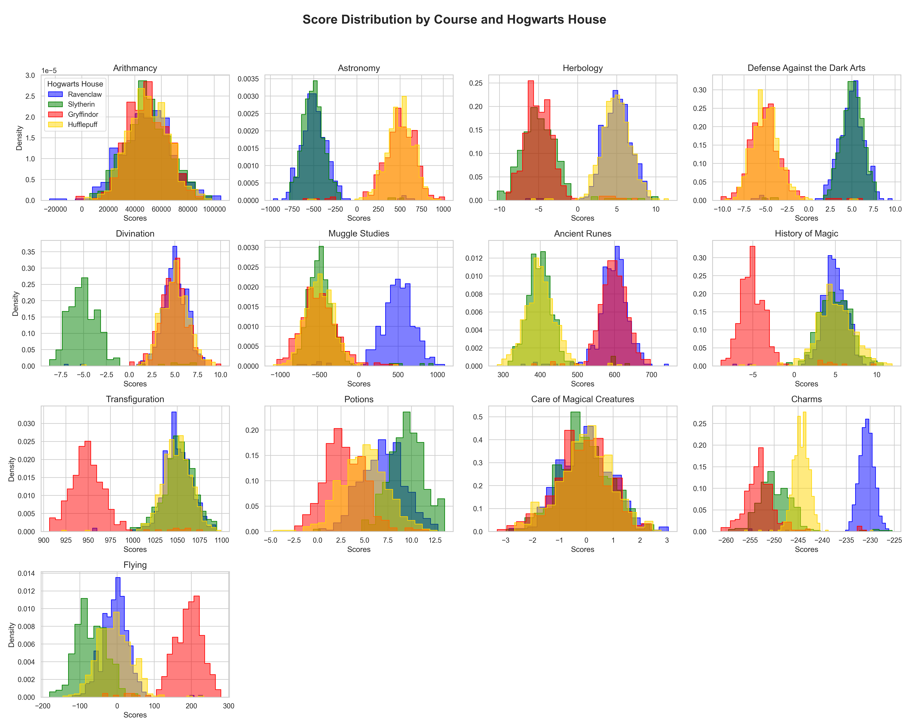
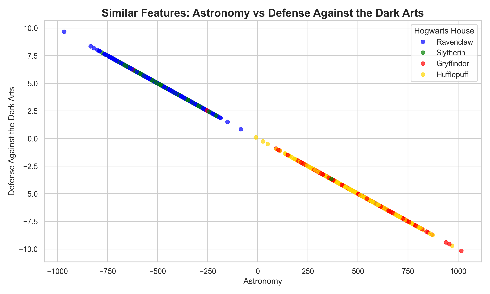

# dslr

Discover Data Science through this project by recreating the Hogwarts Sorting Hat using **logistic regression** — implemented from scratch without high-level ML libraries.

## The Mathematics

This project implements a **one-vs-all logistic regression** classifier. The core math is outlined below.

### Sigmoid Function

The hypothesis $h_\theta(x)$ is defined as:

$$h_\theta(x) = g(\theta^T x)$$

where the **sigmoid** (logistic) function $g(z)$ is:

$$g(z) = \frac{1}{1 + e^{-z}}$$

This squashes any real-valued input into the range $(0, 1)$, which can be interpreted as a probability.

### Cost Function

The cost (loss) function measures how far off the model's predictions are from the true labels:

$$J(\theta) = -\frac{1}{m} \sum_{i=1}^{m} \left[ y_i \log(h_\theta(x_i)) + (1 - y_i) \log(1 - h_\theta(x_i)) \right]$$

where $m$ is the number of training examples and $y_i \in \{0, 1\}$ is the true label.

### Gradient Descent

The partial derivative of the cost function with respect to each weight $\theta_j$ is:

$$\frac{\partial}{\partial \theta_j} J(\theta) = \frac{1}{m} \sum_{i=1}^{m} (h_\theta(x_i) - y_i) \, x_i^{(j)}$$

Weights are updated iteratively:

$$\theta_j := \theta_j - \alpha \frac{\partial}{\partial \theta_j} J(\theta)$$

where $\alpha$ is the learning rate.

### One-vs-All Strategy

Because there are four Hogwarts houses, the model trains **four separate binary classifiers** (one per house). At prediction time the house whose classifier outputs the highest probability wins.

## Linter

This project uses [Ruff](https://docs.astral.sh/ruff/) as the VSCode linter for Python code formatting and linting.

## Setup

Create and activate a virtual environment, then install the dependencies:

```bash
python -m venv venv
source venv/bin/activate
pip install -r requirements.txt
```

## Project Structure

```
dslr/
├── main.py                 # Interactive orchestrator (entry point)
├── data/                   # Datasets & model weights
├── data_analysis/          # Statistical analysis scripts
│   └── describe.py
├── data_visualization/     # Visualization scripts
│   ├── histogram.py
│   ├── pair_plot.py
│   └── scatter_plot.py
├── logistic_regression/    # Logistic regression scripts
│   ├── logreg_train.py
│   └── logreg_predict.py
├── utils/                  # Shared helpers & evaluation
│   ├── utils.py
│   └── evaluate.py
├── requirements.txt
└── README.md
```

## Usage

The easiest way to use the project is through the interactive **main menu**:

```bash
python main.py
```

This launches the Hogwarts Sorting Hat Orchestrator, which presents a numbered menu:

| #   | Command     | Description                                                     |
| --- | ----------- | --------------------------------------------------------------- |
| 1   | `describe`  | Run statistical analysis on the training set                    |
| 2   | `histogram` | Generate histogram of course score distributions                |
| 3   | `scatter`   | Generate scatter plot of similar features                       |
| 4   | `pair`      | Generate a pair plot matrix                                     |
| 5   | `train`     | Train the logistic regression model (saves `data/weights.json`) |
| 6   | `predict`   | Predict houses for the test set (saves `data/houses.csv`)       |
| 7   | `evaluate`  | Compare predictions against ground truth                        |
| 8   | `exit`      | Exit the program                                                |

> **Typical workflow:** `train` → `predict` → `evaluate`

### Running Scripts Individually

Each script can also be run on its own:

```bash
# Data analysis
python data_analysis/describe.py data/dataset_train.csv

# Visualization
python data_visualization/histogram.py
python data_visualization/scatter_plot.py
python data_visualization/pair_plot.py

# Training & prediction
python logistic_regression/logreg_train.py
python logistic_regression/logreg_predict.py

# Evaluation
python utils/evaluate.py data/dataset_truth.csv data/houses.csv
```

### Visualizations

**Histogram** — Score distribution per course and house:



**Scatter Plot** — Two most similar features:



**Pair Plot** — Full feature pair matrix:


